<p align="center">
  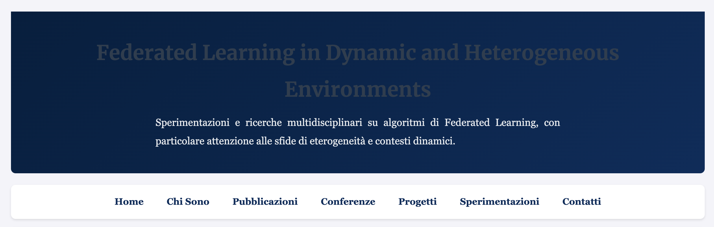
</p>

<h1 align="center">FLOPBG - Federated Learning in Dynamic and Heterogeneous Environments</h1>

<p align="center">
  <strong>A privacy-preserving platform for Federated Learning research on medical imaging, designed for EHDS compliance and real-world healthcare scenarios</strong>
</p>

<p align="center">
  
  
  
  
  
  
  
</p>

<p align="center">
  <em>Developed in collaboration between Universita Mercatorum and Ospedale Pediatrico Bambino Gesu (OPBG)</em>
</p>

---

## Overview

**FLOPBG** is a research platform designed to simulate, evaluate, and compare **Federated Learning (FL)** strategies against centralized approaches. The system focuses on **medical imaging classification** across heterogeneous and dynamic client environments, with a **privacy-by-design** architecture where patient data never leaves the source institution.

The platform includes **3 pre-configured Use Cases** at national (Italy), European (EHDS), and global (WHO) scale, a **dataset recommendation system**, and an interactive geographic visualization of federated nodes.

<p align="center">
  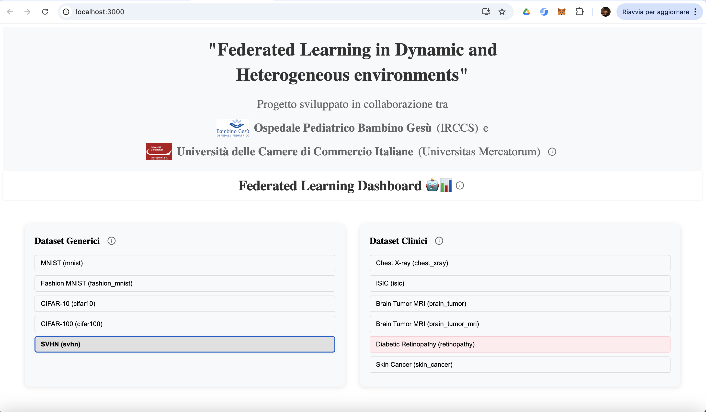
</p>

<p align="center">
  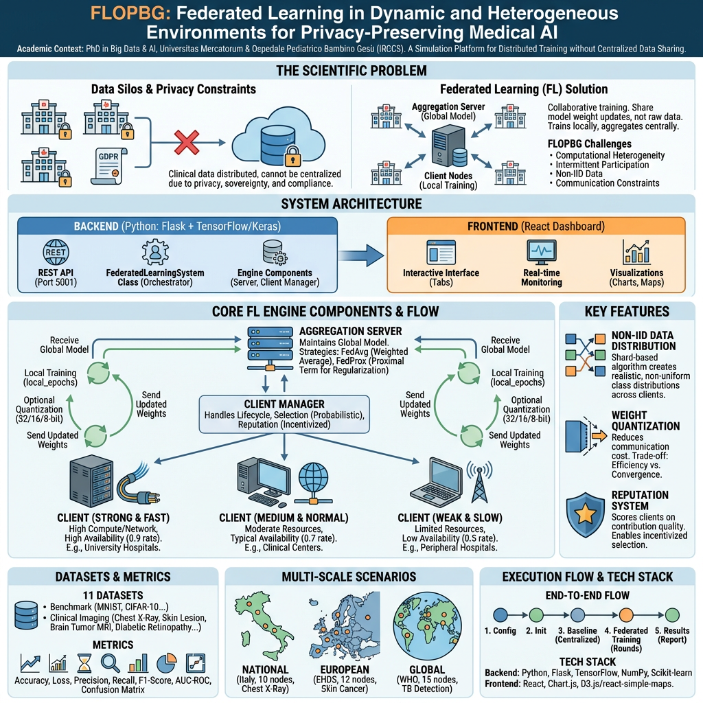
  &nbsp;
  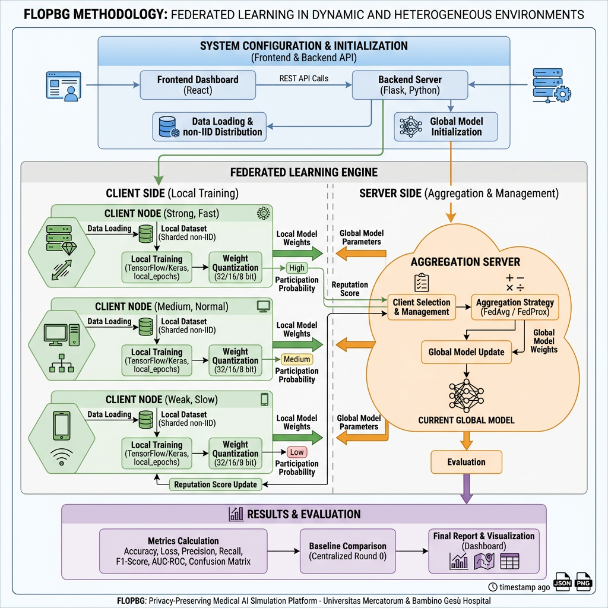
</p>

---

## Key Features

| Feature | Description |
|---------|-------------|
| **12 FL Algorithms** | FedAvg, FedProx, SCAFFOLD, FedNova, FedExP, FedDyn, MOON, FedDisco, FedSpeed, FedLPA, DeepAFL, FedEL |
| **3 Use Cases** | Pre-configured scenarios: National (Italy), European (EHDS), Global (WHO) |
| **Dataset Recommendation** | Automatic suggestion of optimal algorithm and hyperparameters per dataset |
| **Client Heterogeneity** | Simulates strong, medium, and weak clients with different computational power and network speed |
| **Client Dynamism** | Variable participation rates (fast, normal, slow) with dropout simulation |
| **Non-IID Distribution** | Shard-based data partitioning (200 shards, label-ordered) for realistic class imbalance |
| **Weight Quantization** | Configurable 8/16/32-bit compression for communication efficiency |
| **Reputation System** | Quality-based reputation scores for weighted client selection |
| **Geographic Visualization** | Interactive 2D map with 3 scales: National, European, Global (50+ cities) |
| **Dynamic Node Management** | Add, remove, and configure nodes with real-time geographic reassignment |
| **Real-time Dashboard** | 7-tab interface with live monitoring, elapsed time tracking, and image prediction comparison |
| **11 Datasets** | 5 benchmark + 6 clinical medical imaging datasets |
| **Privacy by Design** | GDPR-compliant architecture, data sovereignty at source, EHDS secondary data use support |

---

## Use Cases

The platform provides 3 pre-configured scenarios at different geographic scales, each with optimized algorithm selection, node configuration, and clinical context.

### National - Italian Mountain Hospitals Network

| Parameter | Value |
|-----------|-------|
| **Scope** | 10 hospitals across Italian mountain regions (Aosta to Potenza) |
| **Dataset** | Chest X-Ray (Pneumonia detection) |
| **Algorithm** | FedProx (handles network instability in remote areas) |
| **Rounds** | 100 |
| **Challenge** | Connectivity constraints, heterogeneous infrastructure, small rural hospitals |

### European - EHDS Dermatology Network

| Parameter | Value |
|-----------|-------|
| **Scope** | 12 dermatology centers across Europe (Berlin, Paris, London, Milan, Madrid, Amsterdam, Stockholm, Vienna, Zurich, Lisbon, Athens, Warsaw) |
| **Dataset** | ISIC Skin Lesion (9-class classification) |
| **Algorithm** | SCAFFOLD (corrects gradient drift across heterogeneous centers) |
| **Rounds** | 150 |
| **Challenge** | GDPR compliance, EHDS secondary data use, multi-national data governance |

### Global - WHO Tuberculosis Detection

| Parameter | Value |
|-----------|-------|
| **Scope** | 15 centers across 6 continents (New York, London, Berlin, Tokyo, Beijing, Singapore, Delhi, Lagos, Cairo, Cape Town, São Paulo, Buenos Aires, Melbourne, Paris, San Francisco) |
| **Dataset** | Chest X-Ray (TB detection) |
| **Algorithm** | FedNova (normalizes variable local steps across extreme heterogeneity) |
| **Rounds** | 200 |
| **Challenge** | Extreme computational heterogeneity, 3G connectivity in low-resource areas, intercontinental latency |

---

## Dataset Recommendation System

When a dataset is selected, the platform automatically suggests the optimal algorithm and hyperparameters based on dataset characteristics.

| Dataset | Recommended Algorithm | Rationale |
|---------|----------------------|-----------|
| MNIST | FedAvg | Simple convergence, baseline reference |
| Fashion MNIST | FedAvg | Moderate complexity, SCAFFOLD as alternative |
| CIFAR-10 | SCAFFOLD | Color images, benefits from variance reduction under Non-IID |
| CIFAR-100 | SCAFFOLD | High class count, MOON as alternative |
| SVHN | FedAvg | Large dataset, efficiency-first |
| Chest X-Ray | FedProx | Clinical imbalance, proximal term prevents drift |
| ISIC | FedDisco | Dermatology, distribution-aware weighting handles label variance |
| Brain Tumor | FedProx | Medical imaging, stable convergence |
| Brain Tumor MRI | MOON | Complex imaging, contrastive learning improves representations |
| Diabetic Retinopathy | FedDisco | Ophthalmology, distribution-aware for severity grading |
| Skin Cancer | FedProx | Clinical heterogeneity, binary classification |

---

## Supported Algorithms

| Algorithm | Category | Description |
|-----------|----------|-------------|
| **FedAvg** | Baseline | Weighted averaging of client model updates |
| **FedProx** | Regularization | Proximal term to limit client drift from the global model |
| **SCAFFOLD** | Variance Reduction | Control variates to correct client-server gradient drift |
| **FedNova** | Normalized Aggregation | Normalizes contributions by local gradient steps count |
| **FedExP** | Adaptive Aggregation | Extrapolation-based dynamic step size from pseudo-gradient agreement |
| **FedDyn** | Dynamic Regularization | Per-client dynamic regularizer updated at each round |
| **MOON** | Contrastive Learning | Model-contrastive loss aligning local representations with the global model |
| **FedDisco** | Distribution-Aware | Weights clients by KL-divergence of label distributions from the global distribution |
| **FedSpeed** | Gradient Correction | Proximal term with gradient perturbation correction |
| **FedLPA** | Bayesian Aggregation | Layer-wise precision-weighted (posterior) aggregation |
| **DeepAFL** | Analytic FL | Freezes feature layers and solves classifier via ridge regression |
| **FedEL** | Communication Efficient | Elastic layer selection based on update importance with configurable budget |

---

## Supported Datasets

### Benchmark Datasets

| Dataset | Resolution | Classes |
|---------|-----------|---------|
| MNIST | 28 x 28 x 1 | 10 |
| Fashion MNIST | 28 x 28 x 1 | 10 |
| CIFAR-10 | 32 x 32 x 3 | 10 |
| CIFAR-100 | 32 x 32 x 3 | 100 |
| SVHN | 32 x 32 x 3 | 10 |

### Clinical Datasets

| Dataset | Resolution | Classes | Source | Description |
|---------|-----------|---------|--------|-------------|
| Chest X-Ray | 150 x 150 x 3 | 2 | NIH Clinical Center (112K+ images) | Normal vs Pneumonia |
| ISIC Skin Lesion | 224 x 224 x 3 | 9 | ISIC Collaboration (150K+ images) | Melanoma, nevus, BCC, SCC and more |
| Brain Tumor MRI | 224 x 224 x 3 | 4 | BraTS (2,500+ MRI volumes) | Glioma, meningioma, pituitary, no tumor |
| Diabetic Retinopathy | 224 x 224 x 3 | 5 | EyePACS/Kaggle (88K+ fundus images) | No DR to Proliferative DR |
| Skin Cancer | 224 x 224 x 3 | 2 | HAM10000 (10,015 images) | Benign vs Malignant (histologically confirmed) |
| Brain Tumor | 224 x 224 x 3 | 4 | 3,060 images | Alternative brain tumor dataset |

---

## Architecture

```
                    +---------------------------+
                    |     React Frontend        |
                    |  7 Tabs: Overview |       |
                    |  Datasets | Config |      |
                    |  Nodes | Use Cases |      |
                    |  Experiment & Results     |
                    +------------+--------------+
                                 | Axios (proxy :3000 -> :5001)
                    +------------v--------------+
                    |       Flask REST API       |
                    |  /config /start /status    |
                    |  /stop /datasets /images   |
                    |  /nodes                    |
                    +------------+--------------+
                                 |
              +------------------v------------------+
              |    FederatedLearningSystem Engine    |
              |                                     |
              |  +----------+   +----------------+  |
              |  |  Server   |   | ClientManager  |  |
              |  | (12 aggr. |   | (selection,    |  |
              |  | algorithms)|  |  reputation)   |  |
              |  +----------+   +----------------+  |
              |        |               |            |
              |  +-----v---------------v---------+  |
              |  | Client 1 | Client 2 | ... | N |  |
              |  | (local training, quantization)|  |
              |  +-------------------------------+  |
              +-------------------------------------+
```

<p align="center">
  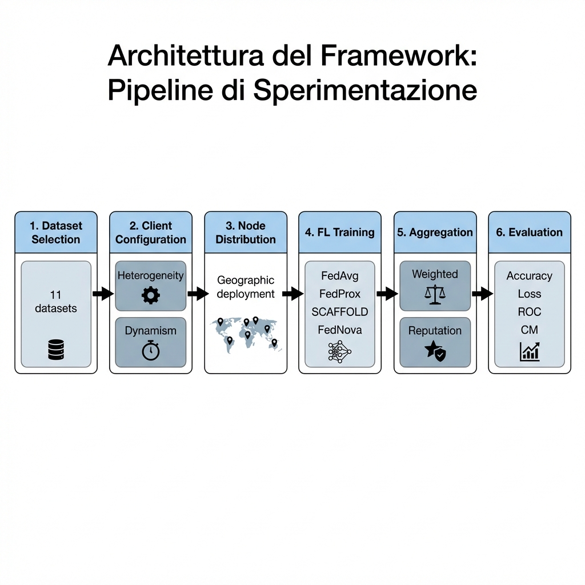
</p>

### Experimentation Pipeline

| Phase | Name | Description |
|:-----:|------|-------------|
| **1** | **Dataset Selection** | Selection from 11 available datasets with automatic algorithm recommendation |
| **2** | **Client Configuration** | Definition of client heterogeneity profiles (strong, medium, weak) and dynamism parameters (participation rate, dropout) |
| **3** | **Node Distribution** | Geographic deployment on interactive map at 3 scales (National, European, Global) with dynamic node management |
| **4** | **FL Training** | Execution of federated training rounds using the selected algorithm (12 available) with real-time monitoring |
| **5** | **Aggregation** | Server-side aggregation with algorithm-specific strategies and reputation-weighted client selection |
| **6** | **Evaluation** | Comprehensive assessment with Accuracy, Loss, ROC-AUC, Confusion Matrix, Precision/Recall/F1, and image prediction comparison |

---

## Privacy and Compliance

FLOPBG is designed with a **privacy-first** architecture aligned with European healthcare regulations:

| Principle | Implementation |
|-----------|---------------|
| **Data Sovereignty** | Patient data never leaves the source institution; only model weights are transmitted |
| **GDPR Compliance** | No centralized data storage; processing occurs at the data source |
| **EHDS Secondary Use** | Supports European Health Data Space regulations for secondary data use in research |
| **Communication Security** | Weight quantization (8/16/32-bit) reduces transmitted information |
| **Selective Participation** | Reputation-based client selection with configurable participation rates |

---

## Centralized vs Federated Learning

The platform provides direct comparison between centralized and federated training approaches, with detailed metrics at each round including accuracy convergence gap analysis.

<p align="center">
  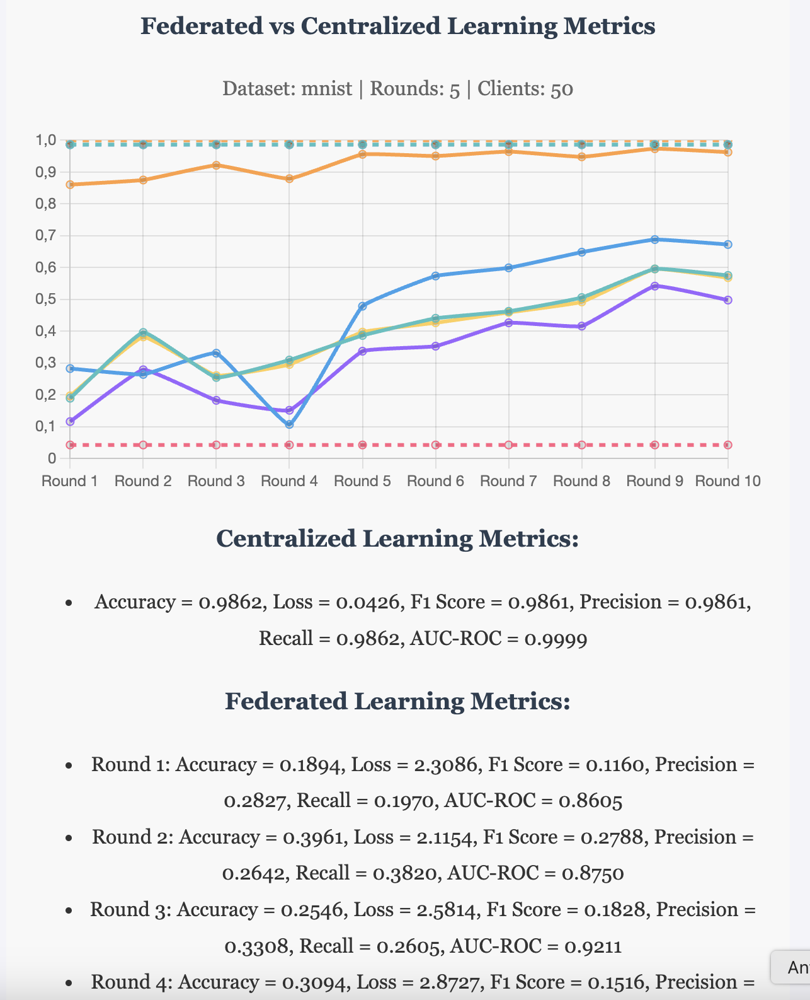
</p>

---

## Geographic Node Distribution

Clients are mapped to geographic locations on an interactive 2D map with zoom and pan. Each node is color-coded by computational tier (strong/medium/weak) and sized by dynamism (fast/normal/slow). Three geographic scales are available:

- **National**: 27 Italian cities including mountain and rural hospitals
- **European**: 11 major European medical centers
- **Global**: 50+ cities across 6 continents

<p align="center">
  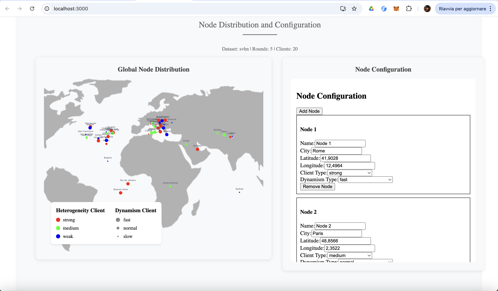
</p>

<p align="center">
  
</p>

---

## Platform Dashboard

The web dashboard is organized in **7 tabs**: Overview, Datasets, Basic Configuration, Advanced Configuration, Node Distribution, Use Cases, and Experiment. It provides full control and real-time monitoring with elapsed time tracking.

<p align="center">
  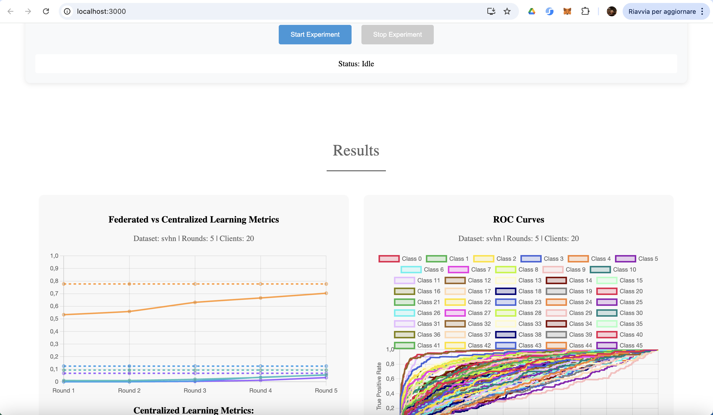
</p>

<p align="center">
  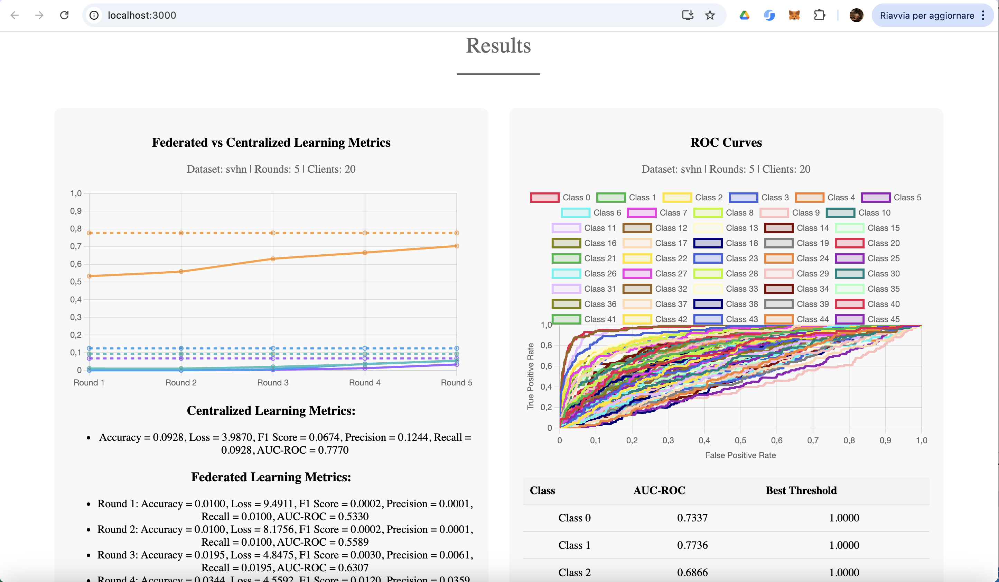
</p>

<p align="center">
  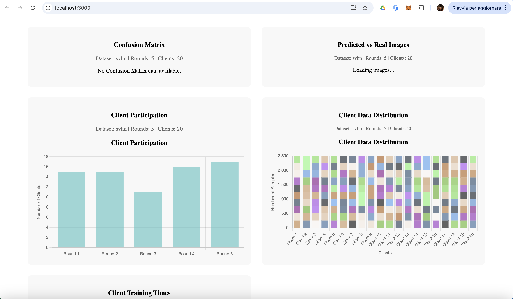
</p>

<p align="center">
  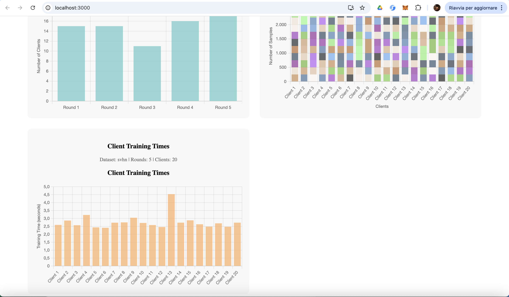
</p>

---

## Experiment Results

Output generated by the platform after a federated learning experiment (MNIST, 10 clients, 10 rounds, FedAvg).

### Model Performance

<p align="center">
  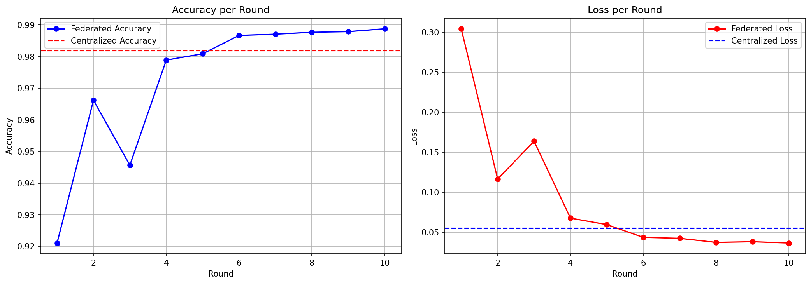
</p>

<p align="center">
  <em>Federated vs Centralized accuracy and loss convergence across training rounds</em>
</p>

<p align="center">
  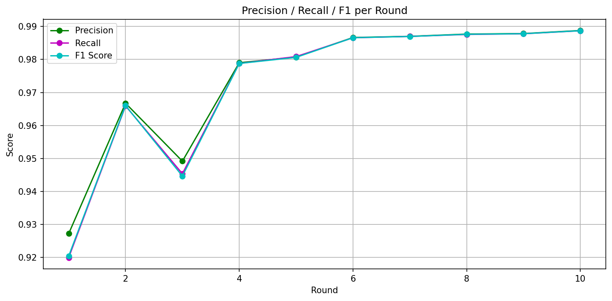
</p>

<p align="center">
  <em>Precision, Recall and F1-Score progression per round</em>
</p>

### Classification Analysis

<p align="center">
  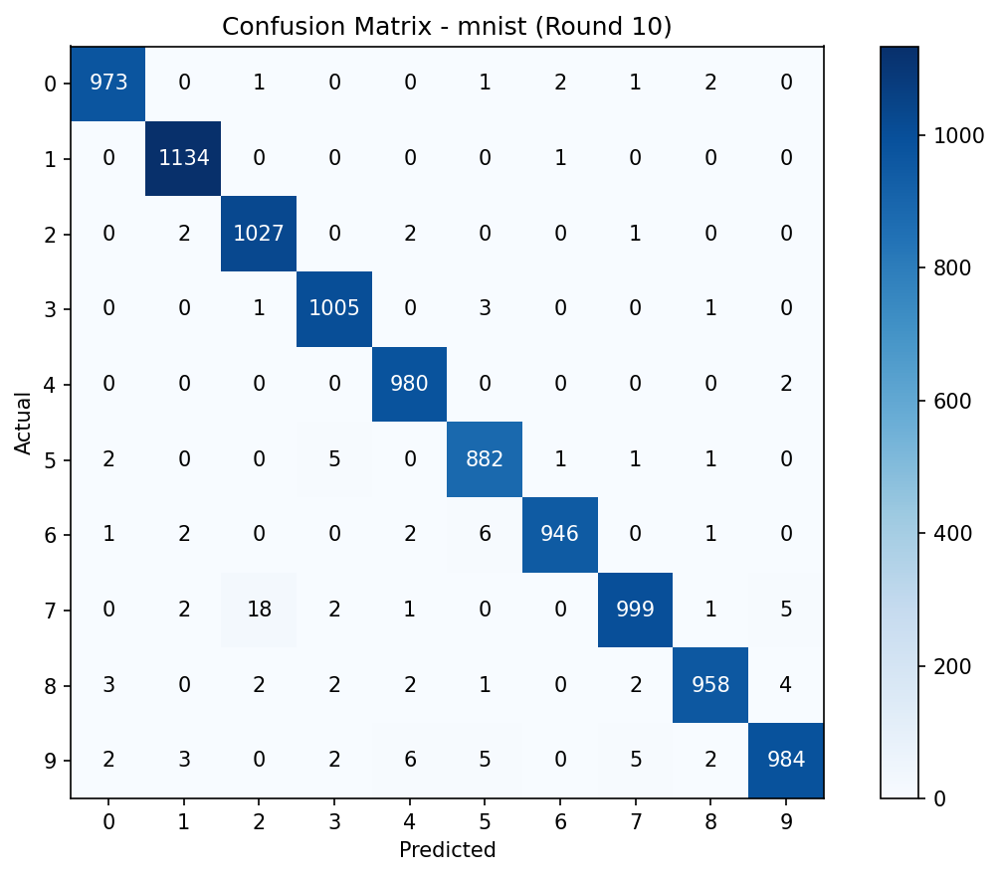
  &nbsp;
  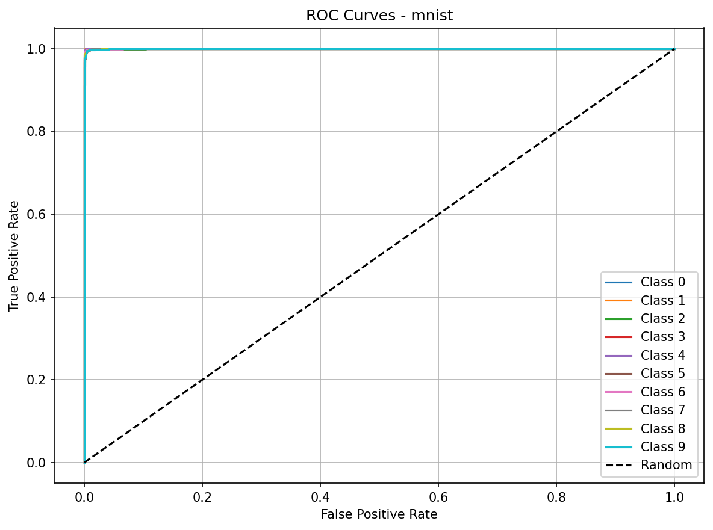
</p>

<p align="center">
  <em>Confusion Matrix (left) and per-class ROC Curves (right) at final round</em>
</p>

### Client Analysis

<p align="center">
  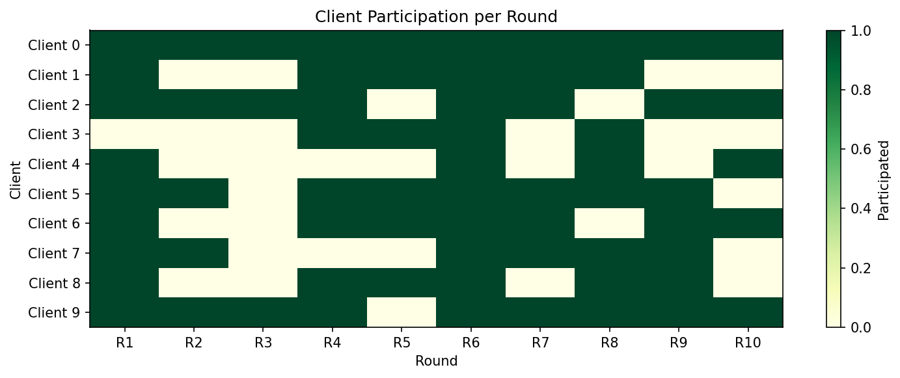
</p>

<p align="center">
  <em>Client participation heatmap showing dynamic availability across rounds</em>
</p>

<p align="center">
  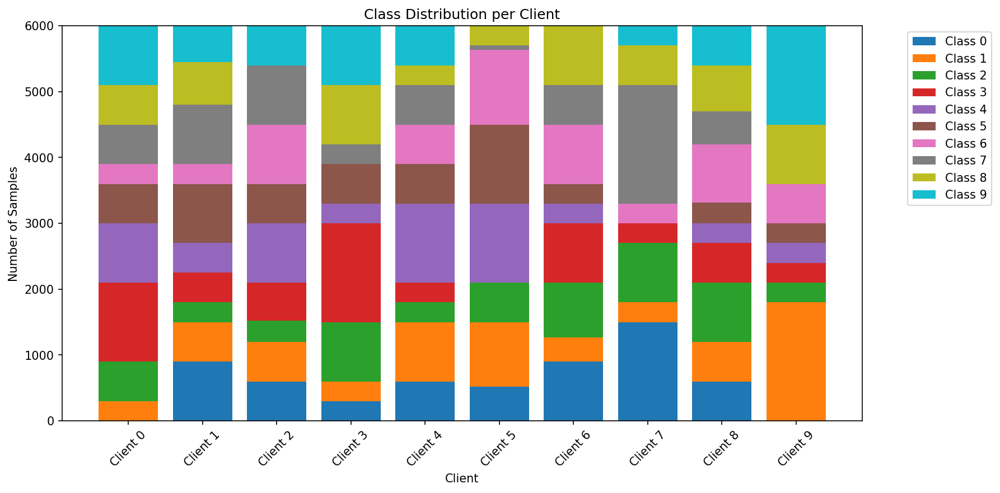
  &nbsp;
  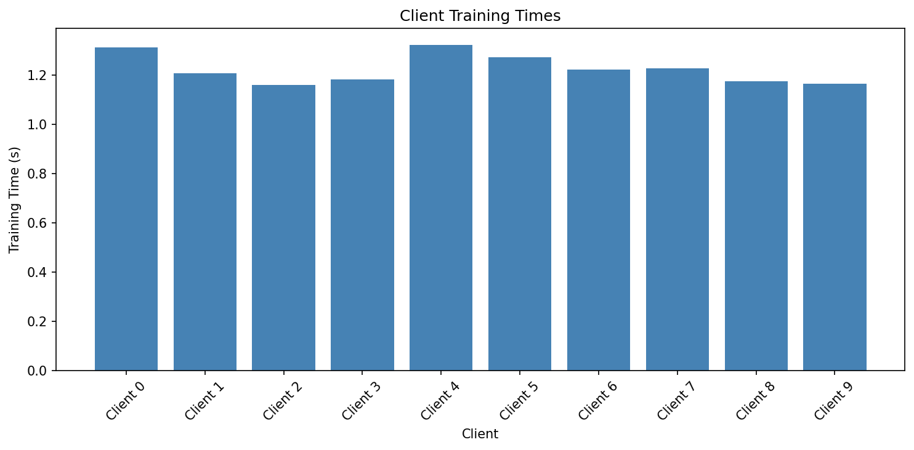
</p>

<p align="center">
  <em>Non-IID class distribution per client (left) and training times reflecting client heterogeneity (right)</em>
</p>

---

## Experiment Configuration

Full control over FL parameters: number of rounds, clients, learning rate, aggregation algorithm, client heterogeneity profiles, and dynamism settings.

<p align="center">
  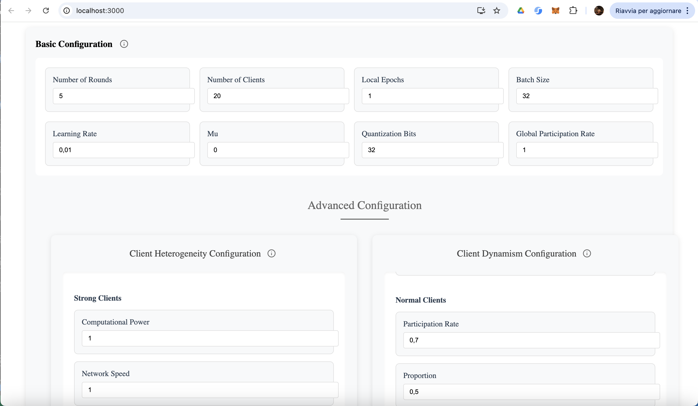
</p>

<p align="center">
  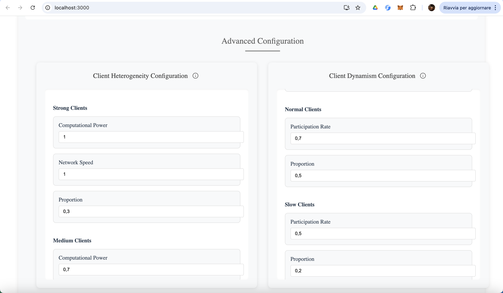
</p>

---

## Non-IID Data Distribution

The platform implements a **shard-based Non-IID distribution** to simulate realistic data heterogeneity across federated clients:

1. Training data is sorted by label
2. Data is divided into **200 shards** of equal size
3. Shards are randomly shuffled
4. Shards are distributed round-robin across clients

This results in each client having a different class distribution, mimicking real-world scenarios where each hospital specializes in different pathologies.

---

## Project Structure

```
flopbg/
├── application/                      # Backend FL engine
│   ├── app.py                        # Flask REST API server
│   ├── federated_learning_system.py  # Core FL logic (12 algorithms)
│   ├── report_manager.py            # Report generation & scheduling
│   ├── nodes.json                    # Hospital node configuration
│   ├── _Reports_/                    # Generated experiment reports
│   └── reports/                      # Reporting modules
│       ├── fl_reports.py             # FL-specific reporting
│       ├── metrics.py                # Metrics calculation
│       └── visualization.py          # Chart generation (8 chart types)
├── application_frontend/             # React frontend
│   ├── src/
│   │   ├── App.js                    # Main app (7 tabs, recommendation engine)
│   │   ├── components/               # UI components (19+)
│   │   │   ├── ExperimentConfig/     # Basic & Advanced configuration
│   │   │   ├── GlobeVisualization.js # Interactive 2D geographic map
│   │   │   ├── NodeConfiguration.js  # Dynamic node management
│   │   │   ├── ImageComparison.js    # Real vs Predicted comparison
│   │   │   ├── ROCChart.js           # Per-class ROC curves
│   │   │   ├── ConfusionMatrixChart.js
│   │   │   └── ...
│   │   ├── hooks/                    # Custom React hooks
│   │   └── data/
│   │       ├── useCases.js           # 3 pre-configured scenarios
│   │       └── worldCities.js        # 50+ cities (IT, EU, Global)
│   └── package.json
├── clients/
│   ├── client.py                     # FL client (12 training methods)
│   └── client_manager.py            # Reputation-weighted selection
├── server/
│   └── server.py                     # Aggregation server (12 strategies)
├── models/
│   └── model_definition.py          # CNN architectures (4 model types)
├── data/
│   └── data_loading.py              # Dataset loading & Non-IID splitting
├── utils/
│   ├── metrics.py                   # Evaluation metrics
│   ├── visualization.py            # Plotting utilities
│   └── sanitization.py             # Input validation
├── config.yaml                      # Experiment configuration
└── requirements.txt                 # Python dependencies
```

---

## Getting Started

### Prerequisites

- Python 3.10+
- Node.js 18+
- Conda (recommended)

### Installation

**1. Clone the repository**
```bash
git clone https://github.com/FabioLiberti/flopbg.git
cd flopbg
```

**2. Create and activate the conda environment**
```bash
conda create -n flopbg python=3.10 -y
conda activate flopbg
pip install -r requirements.txt
```

**3. Install frontend dependencies**
```bash
cd application_frontend
npm install
cd ..
```

**4. Download datasets**

Clinical datasets must be downloaded separately and placed in the `data/` directory following this structure:
```
data/
├── chest_xray/train/  &  test/
├── ISIC/train/  &  test/
├── Brain Tumor MRI/Training/  &  Testing/
├── Retinopatia/
└── Skin Cancer/train/  &  test/
```

### Running the Application

**Terminal 1 - Backend:**
```bash
conda activate flopbg
python application/app.py
```

**Terminal 2 - Frontend:**
```bash
cd application_frontend
npm start
```

The application will be available at `http://localhost:3000` with the API running on port `5001`.

---

## Configuration

All experiment parameters are managed through `config.yaml` or via the dashboard UI:

```yaml
# Training parameters
global_epochs: 2
local_epochs: 1
batch_size: 32
learning_rate: 0.001
mu: 0.1                          # FedProx / FedSpeed proximal term
num_clients: 5
quantization_bits: 32            # 8, 16, or 32
global_participation_rate: 1.0

# Client heterogeneity
client_types:
  strong:   { computational_power: 1.0, network_speed: 1.0, proportion: 0.3 }
  medium:   { computational_power: 0.7, network_speed: 0.7, proportion: 0.5 }
  weak:     { computational_power: 0.4, network_speed: 0.5, proportion: 0.2 }

# Client dynamism
client_dynamism:
  fast:     { participation_rate: 0.9, proportion: 0.3 }
  normal:   { participation_rate: 0.7, proportion: 0.5 }
  slow:     { participation_rate: 0.5, proportion: 0.2 }
```

---

## Evaluation Metrics

| Metric | Description |
|--------|-------------|
| Accuracy | Overall classification accuracy (FL vs Centralized) |
| Precision | Macro-averaged precision per round |
| Recall | Macro-averaged recall per round |
| F1-Score | Macro-averaged F1 per round |
| AUC-ROC | Area under the ROC curve (per-class and macro) |
| Confusion Matrix | Full NxN classification matrix at each round |
| Training Time | Per-client and per-round timing breakdown |
| Image Comparison | Side-by-side real vs predicted inference results |

---

## Tech Stack

**Backend:** Python 3.10 | Flask | TensorFlow/Keras | scikit-learn | NumPy | Matplotlib | Plotly

**Frontend:** React 18 | Material-UI | Chart.js | Recharts | react-simple-maps | D3.js | Axios

---

## Roadmap

- [ ] Differential privacy mechanisms
- [ ] Docker containerization
- [ ] Distributed training across physical nodes
- [ ] Database persistence for experiment results
- [ ] OpenAPI/Swagger documentation

---

## Authors

**Fabio Liberti** - Universita Mercatorum / OPBG

---

## License

This project is developed for academic research purposes.
